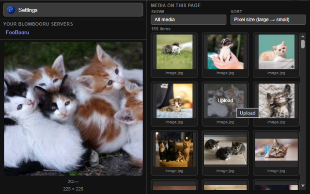
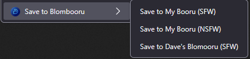
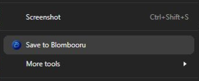

# Save to Blombooru

**Right-click to send any image/video to your Blombooru**

A **Firefox** and **Chrome** extension to push media to a [Blombooru](https://github.com/mrblomblo/blombooru) instance while browsing the web.

  


## Install

You'll need:

- **Firefox**, **Chrome**, or a derivative (e.g. Edge, LibreWolf) that supports extensions.
- A working **Blombooru** installation on your LAN or reachable over the Internet.

Click the appropriate link below to install for your browser:

[](https://chromewebstore.google.com/detail/mhnaejinolnamebgpomkpbmdhjhnhlji)

[](https://addons.mozilla.org/en-US/firefox/addon/save-to-blombooru@foo/)


### Configure Blombooru

1. Click the extension icon (or **Add-ons** → **Save to Blombooru** → **Options**).
2. Enter your Blombooru URL (same origin you use in the browser, e.g. `http://192.168.0.50:8000`).
3. Grant host access if prompted.
4. Wait for **Connection successful**, then **Save Settings**.
5. Optionally set a **friendly name** (right-click menu) and **default rating**.

If you do not use an API key, log into the Blombooru admin UI once in the same browser profile so session cookies are available for uploads.

To add another server, use **Add another server**, then save.

## Upload

1. Right-click an image or video.
2. Choose **Save to Blombooru**.
3. Watch the toolbar badge for status.

Failed uploads show a notification with the error.

---

## Development / Sideload Install

Clone or download this repository.

**Firefox or Chrome**

Build/stage before loading (you need **node** and **tar** at the command line):

```
node scripts/build.mjs firefox   # or: chrome
```

1. **Firefox / LibreWolf:** `about:debugging` → **This Firefox** → **Load Temporary Add-on…** → choose `build/staging-firefox/manifest.json`. Requires **Firefox 140+** (uses `background.scripts`).
2. **Chrome / Edge:** `chrome://extensions` or `edge://extensions` → **Developer mode** → **Load unpacked** → `build/staging-chrome` (Chrome 121+; uses `background-sw.chrome.js` service worker).

After changing background or popup code, run the build again and reload the extension.

Note: Temporary loads do not persist across browser restarts.

Both builds use **`activeTab`** plus **optional** host access (`http://*/*`, `https://*/*`), prompted when you configure your Blombooru URL in options or on first upload to a new origin. Neither build requests `<all_urls>` at install time.

### Building packages

Running the build script will different parameters will produce different outputs:

```
node scripts/build.mjs          # Produces Firefox + Chrome ZIPs
node scripts/build.mjs firefox  # Produces Firefox ZIP (for AMO only)
node scripts/build.mjs chrome   # Produces Chrome ZIP (for Chrome Web Store only)
node scripts/build.mjs clean    # remove build/
```

Outputs (version from manifest):

- `build/save-to-blombooru-firefox-<version>.zip` — [addons.mozilla.org](https://addons.mozilla.org/)
- `build/save-to-blombooru-chrome-<version>.zip` — Chrome Web Store

The `build/` directory is git-ignored. ZIPs use `tar` so paths use forward slashes (required by Firefox).

## Project layout

```
save-to-blombooru/
├── scripts/build.mjs       # Stage src/ → build/staging-* and ZIP packages
├── build/                  # gitignored: staging dirs and release ZIPs
└── src/
    ├── manifest.firefox.json
    ├── manifest.chrome.json
    ├── background-modules.firefox.json  # Firefox script order (injected at build)
    ├── background-sw.chrome.js          # Chromium service worker entry
    ├── browser.js                       # browser/chrome shim
    ├── background.js                    # Context menu, uploads, notifications
    ├── auth.js                          # API auth and connection test
    ├── servers.js                       # Multi-server storage
    ├── permissions.js                   # Host permissions, upload prep
    ├── media-context.js                 # Injected page scripts (caption, gallery)
    ├── options.html / options.js
    ├── popup.html / popup.js            # Toolbar popup and page media gallery
    ├── tab-scripting.js
    ├── i18n-ui.js
    ├── _locales/                        # en, de, fr, es, pt_BR
    └── icon.png
```

The build writes a single `manifest.json` into each staging directory (background section merged from the platform entrypoints above).

---

## Contributing & license

Issues and pull requests are welcome.

Released under the [MIT License](LICENSE).

---

## Acknowledgements

Built for **[Blombooru](https://github.com/mrblomblo/blombooru)** — a self-hosted, booru-style media library you control. This extension is unofficial and not affiliated with the Blombooru project; names are used to describe compatibility only.

All credit for Blombooru itself sits with [Blombo](https://github.com/mrblomblo) and the maintainers at the [Blombooru](https://github.com/mrblomblo/blombooru) project.
